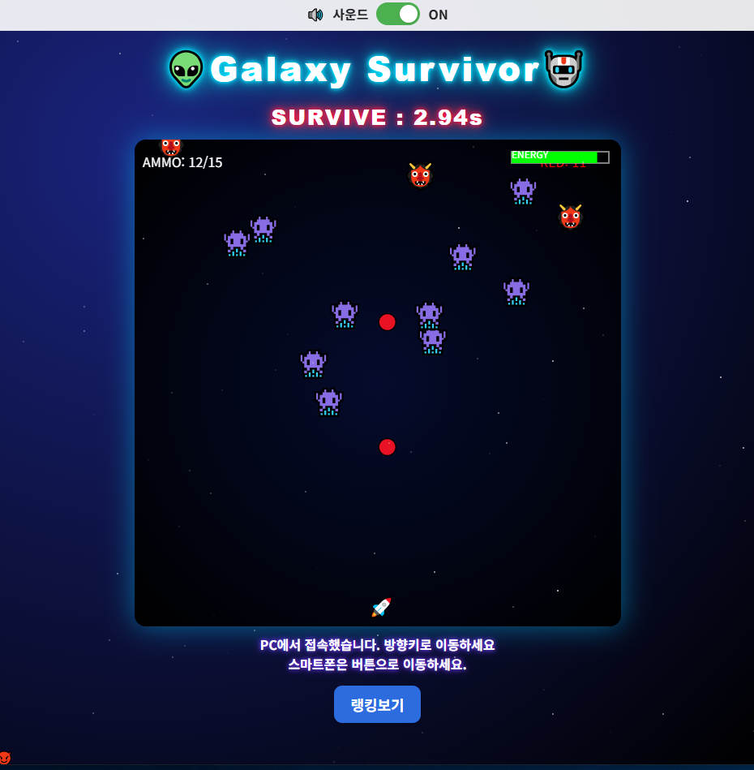
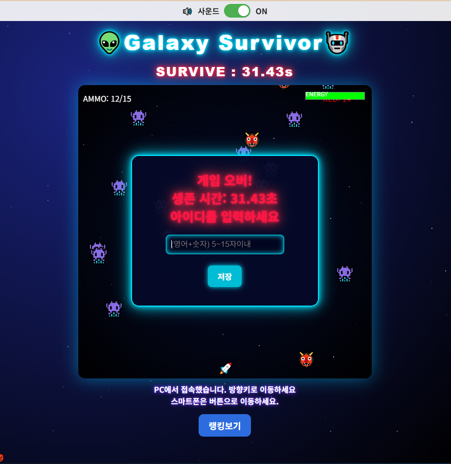
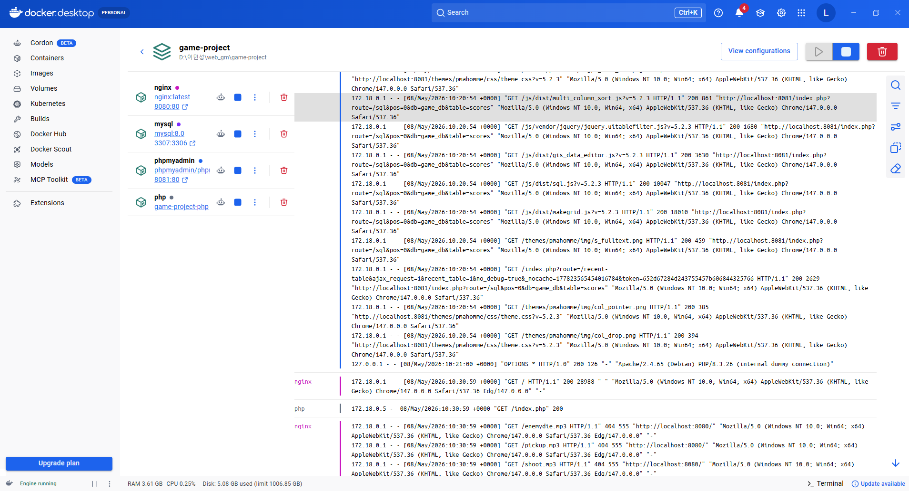
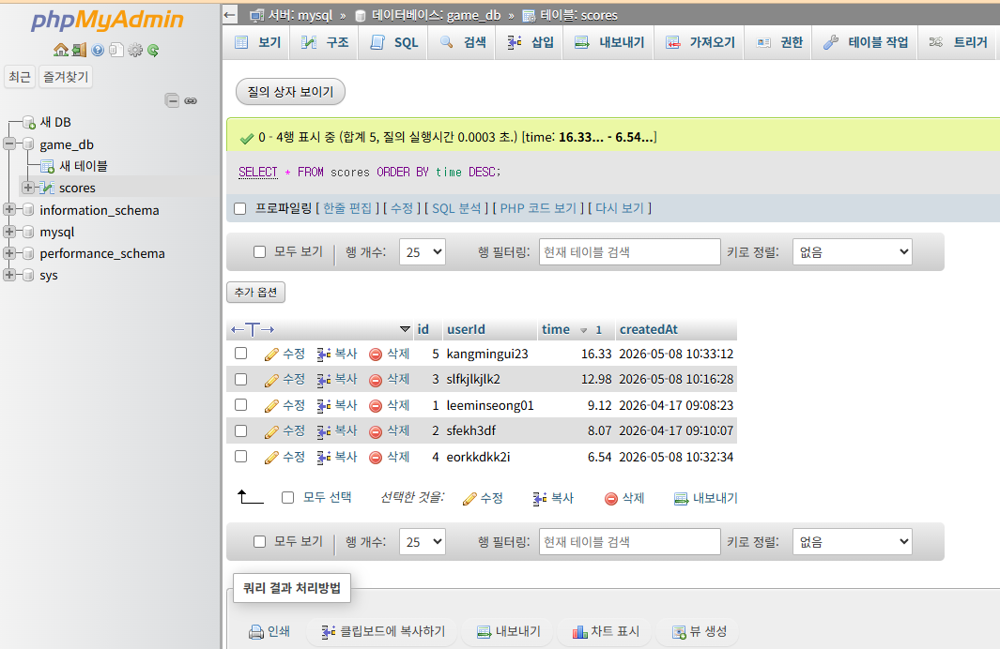

# 👾 Galaxy Survivor (Docker + PHP + MySQL)

> Docker Desktop + PHP + MySQL + Nginx 기반 웹게임 프로젝트

---

# 🎮 프로젝트 소개

Galaxy Survivor는 외계인을 피해 최대한 오래 살아남는 웹 게임입니다.

기존 버전은 Firebase Firestore에 점수를 저장했지만,  
이번 버전에서는 **Docker 환경**에서 직접 PHP + MySQL 서버를 구축하여  
랭킹 시스템을 구현했습니다.

---

# 🚀 주요 기능

- 🚀 우주선 이동
- 👾 적 생성 시스템
- 🔫 총알 발사
- 🔋 체력 회복 아이템
- ❤️ 에너지 시스템
- 🏆 실시간 랭킹 저장
- 📱 모바일 조작 지원
- 🔊 사운드 ON/OFF
- 🐳 Docker 기반 서버 환경

---

# 🛠 사용 기술

## Frontend
- HTML5 Canvas
- CSS3
- JavaScript

## Backend
- PHP
- MySQL
- phpMyAdmin

## Server
- Docker Desktop
- Docker Compose
- Nginx

---

# 📂 프로젝트 구조

```bash
galaxy-survivor-docker/
│
├── html/
│   ├── index.php
│   ├── rank.php
│   ├── save.php
│   ├── get_rank.php
│   └── db.php
│
├── nginx/
│   └── default.conf
│
├── Dockerfile
├── docker-compose.yml
└── README.md
```

---

# 🐳 Docker 구성

## docker-compose.yml 역할

- PHP 컨테이너 실행
- MySQL 컨테이너 실행
- Nginx 웹서버 연결
- phpMyAdmin 연결

---

# ⚙️ 실행 방법

## 1. Docker Desktop 실행

Docker Desktop을 먼저 실행합니다.

---

## 2. 컨테이너 실행

```bash
docker-compose up -d
```

---

## 3. 접속

### 🎮 게임 페이지
http://localhost:8080

### 🏆 랭킹 페이지
http://localhost:8080/rank.php

### 🗄 phpMyAdmin
http://localhost:8081

---

# 🗄 MySQL 랭킹 저장 구조

게임 종료 후 플레이어 기록이 MySQL에 저장됩니다.

저장 정보:

- 아이디
- 생존 시간
- 저장 시간

---

# 🔥 기존 Firebase 버전과 차이점

## 이전 방식
- Firebase Firestore 사용
- 클라우드 기반 저장

## 현재 방식
- Docker 내부 MySQL 사용
- PHP 서버 직접 구축
- 로컬 데이터베이스 관리 가능

---

# 📸 실행 화면

## 게임 시작 화면


---

## 게임 플레이



---

## 랭킹 저장



---

## Docker Desktop 실행 화면



---

## phpMyAdmin 데이터 저장 확인



---

# 📌 PHP 파일 역할

| 파일 | 역할 |
|---|---|
| index.php | 메인 게임 |
| rank.php | 랭킹 페이지 |
| save.php | 점수 저장 |
| get_rank.php | 랭킹 불러오기 |
| db.php | MySQL 연결 |

---

# 📌 Nginx 역할

Nginx는 웹 서버 역할을 하며  
PHP 요청을 PHP 컨테이너로 전달합니다.

---

# 📌 Docker 사용 이유

Docker를 사용하면:

- 서버 환경 통일 가능
- 설치 과정 단순화
- PHP / MySQL 쉽게 연결 가능
- 다른 PC에서도 동일 환경 실행 가능

---

# 👨‍💻 제작자

- GitHub: lms01-hub

---

# ⭐ 프로젝트 목표

- Docker 이해
- PHP + MySQL 연동
- 웹 게임 서버 구조 학습
- 랭킹 시스템 구현
- 실제 웹 서비스 구조 경험
